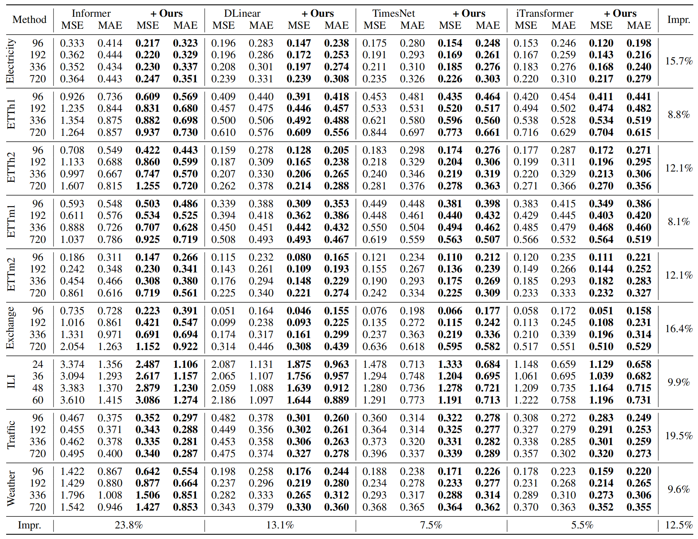

<div align="center">

# GLAFF

[](https://arxiv.org/abs/2409.18696)


</div>

**Rethinking the Power of Timestamps for Robust Time Series Forecasting: A Global-Local Fusion Perspective**

Time series forecasting has played a pivotal role across various industries, including finance, transportation, energy, healthcare, and climate. Due to the abundant seasonal information they contain, timestamps possess the potential to offer robust global guidance for forecasting techniques. However, existing works primarily focus on local observations, with timestamps being treated merely as an optional supplement that remains underutilized. When data gathered from the real world is polluted, the absence of global information will damage the robust prediction capability of these algorithms. To address these problems, we propose a novel framework named GLAFF. Within this framework, the timestamps are modeled individually to capture the global dependencies. Working as a plugin, GLAFF adaptively adjusts the combined weights for global and local information, enabling seamless collaboration with any time series forecasting backbone. Extensive experiments conducted on nine real-world datasets demonstrate that GLAFF significantly enhances the average performance of widely used mainstream forecasting models by 12.5%, surpassing the previous state-of-the-art method by 5.5%.


## 	Get Started

1. Install Python 3.10.13 and PyTorch 2.1.2.

2. Download datasets and checkpoints from [Google Cloud](https://drive.google.com/drive/folders/1028Ky-bJU6rSBXIMR6tf0wRAAvxIS6xP?usp=sharing). The datasets have been well pre-processed.

3. You can readily observe the superiority of GLAF through the checkpoints we provide:

   ```shell
   bash ./test.sh
   ```

4. You can also retrain GLAFF independently:

   ```shell
   bash ./run.sh
   ```

## Main Result

We conduct comprehensive experiments on nine real-world benchmark datasets across five domains. The result demonstrates that GLAFF significantly improves the robust prediction capability of mainstream forecasting models.



## Citation

If you find this repo or our work useful for your research, please consider citing the paper:

```tex
@inproceedings{
  author    = {Chengsen Wang and Qi Qi and Jingyu Wang and Haifeng Sun and Zirui Zhuang and Jinming Wu and Jianxin Liao},
  title     = {Rethinking the Power of Timestamps for Robust Time Series Forecasting: A Global-Local Fusion Perspective},
  booktitle = {Thirty-eighth Conference on Neural Information Processing Systems},
  year      = {2024},
}
```

## Contact

If you have any question, please contact [cswang@bupt.edu.cn]().
